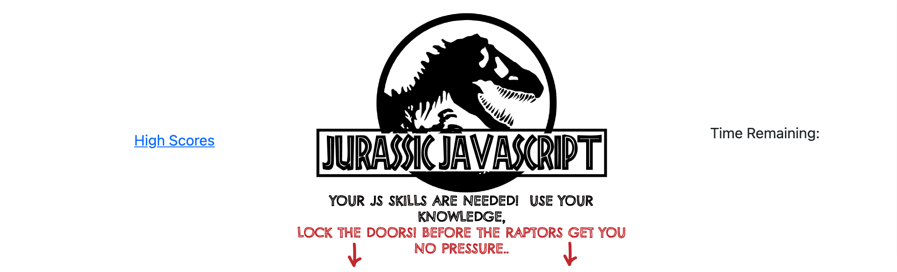

# Javscript API Quiz Challenge

## Purpose
A website that quizzes users on their javascript skills

## Built With
* HTML
* CSS
* JS

## Website
https://missaimeejay.github.io/APIQuizChallenge/

## Contribution
Made with ❤️ by Aimee Jesso

## Important credits and mentions
-My time count down was referenced from a stack overflow link that I modified for my project
https://stackoverflow.com/questions/20618355/how-to-write-a-countdown-timer-in-javascript/20618592#20618592
-The timer countdown was added before we learned about moment.js APIs and methods
(we were told half way through the project to reference code help material in the readme file and I'm adding what I can remember)
-Some code was initially referenced from gibhub repositories but I stopped doing that because I fear it is too close to plagerism if I look at them
-I did what I could with the challenge but it started to take up more time than I had to spare
-Javascript questions were reviewed at quizlet.com *open to the public

### ©️2021

